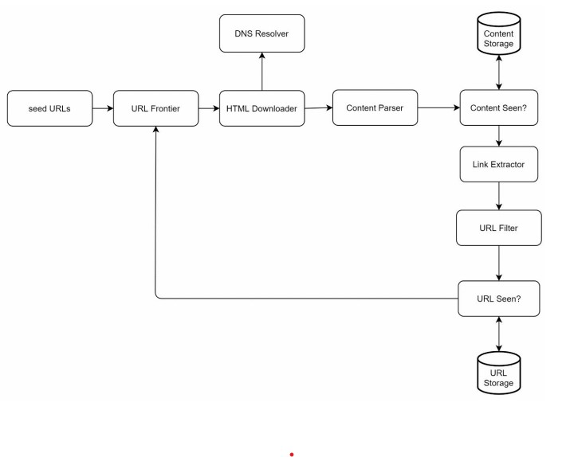

# GoCrawler

Well, this is done as an LLD (Low level design of a Web Crawler)

## What's a GoCrawler/WebCrawler?
We can think of a Web Crawler as something like a robot or a spider, used widely by the web-search engines to index web-pages.A crawler attends a web-page and then again visits all the links in the web-page.This work is very high predominance, as the Browsers , basically measure websites on the basis of Centrality measures(Social Network Analysis), which is another way of saying that the more connections to other websites it makes , the better it's ranked by the search engine.
Other cases where, these are very prominently used are the web mining /Data mining cases.
 

## High-Level design of a web Crawler using Go and what I've done here.
 
So let me do a design deep-dive
 
- DFS vs BFS 
- URL Frontier 
- Robustness 
- Extensibility 
- Detect and avoid problematic content(if-needed only, minute feature implementation.) 

 
Let's Assume the WWW to be a huge graph with each node being a web-page, and it's edges being the URLs that connect them. And the crawler is just a tool that traverses this graph. 
So to traverse a graph, there's two famous algos, being DFS and BFS, DFS doesn't seem to be the viable option, because the depths of the graphs can very deep, possibly millions of pages.Therefore,BFS is a very plausible approach. 
Also storing them ,has to be a huge priority, because in a real-world scenario,there'll be hundreds of millions of web-pages and putting everything in-memory is neither durable nor scalable, keeping everything in disk isnt as well, because the disk is slow and can be a bottleneck.  
So it's very feasible to maintain a hybrid approach, by storing the majority of the URLs in disk and the rest in-memory as the Enqueue and Dequeue operations are happening, also the data in memory can be stored in a trie-based key-value store and data that's in the buffer is written to the Disk. 
Considering that I'm writing this for an HLD ,we better distribute the seed URLs for multiple servers(sharding).
The above mentioned functionalities have been implemented in a very small scale. 
Below is an Architecture of an efficient Web-Crawler.  
